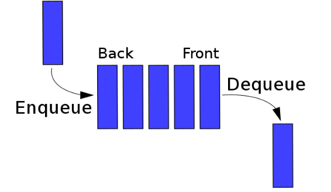
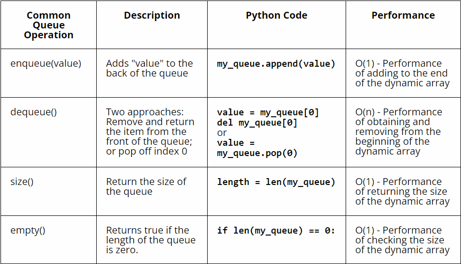

# Queues

**Basic Concept Of Queues**

A queue is a fundamental concept in computer science and data structures. 

To grasp the concept of a queue, it's helpful to draw a comparison with another common structure called a stack.

A stack operates on the principle of Last In, First Out (LIFO), meaning that the last item added to the stack is the first one to be removed. Conversely, a queue follows the principle of First In, First Out (FIFO), where the item that enters the queue first is the one to be removed first.

**Queue ATM Example**

Imagine you're at an ATM in a busy area. There's a line of people waiting to withdraw money. This line operates on the principle of First In, First Out (FIFO). The person who arrived first at the ATM will be the first to complete their transaction and leave. As each person finishes their transaction, the next person in the queue steps forward to access the machine. This orderly system ensures that everyone has a fair chance to use the ATM, with those who've been waiting the longest being served first. So today you have learned that you have been surround by and influenced by Queues one way or another throughout your life. 

**Operation on Queues**

Now lets dive into writing Queues in python. In Python a Queue is represented by using a list.
lets say that we have a list like this:
***
    queue = Queue()
    queue = []

    # we have already enqueue the people below
    # this is what you see in the Queue
    # queue = [Abby, Mark, lexi, Johnny]
***
To enqueue an item or in simplier words add to the queue we must do the follow:
***
    queue.append('Jack')
    queue.append('April')
    # This will enqueue Jack and April to the list Queue

    # It would look like this
    # queue = [Abby, Mark, lexi, Johnny, Jack, April]
***
 Now to Dequeue an item from the front of the list you must call the index of [0] on the list or you can use the operation of del to obtain the first element in the list. 
 ***
    # We will use the same Queue above to understand
    # queue = [Abby, Mark, lexi, Johnny, Jack, April]

    queue.dequeue() # remove from the earliest entity added to the Queue
 ***
 
 Below are more was that you can Enqueue data into a list, get the size of the list, and even empty they list. It also talks about the performance that the data structure is able to do in Big O' notation. 

## Type of Queues

***Simple Queue (Linear Queue)***

We talked about this in the first section, Imagine back to the ATM line again.

**Key points:**
- **First-In-First-Out (FIFO):** The first person who joins the queue is the first one to get served.
- **Adding and Removing:** People join the queue at the end, and when it's their turn, they get served and leave from the front.
## Example usage:
    class SimpleQueue:
        def __init__(self):
            self.items = []

        def enqueue(self, item):
            self.items.append(item)

        def dequeue(self):
            if not self.is_empty():
                return self.items.pop(0)
            else:
                return "Queue is empty"

        def is_empty(self):
            return len(self.items) == 0

        def size(self):
            return len(self.items)

***Circular Queue***

Picture a merry-go-round at a playground. A circular queue works in a similar way! It's like a line of people holding hands in a circle.

**Key points:**
- **Circular Structure:** The last person in the queue is connected to the first person, forming a circle.
- **Overwriting:** If the queue is full and new people join, they start replacing the oldest ones, just like when the merry-go-round goes around and around.

## Example usage:

    q = SimpleQueue()
    q.enqueue(1)
    q.enqueue(2)
    q.enqueue(3)

    print(q.dequeue())  # Output: 1
    print(q.dequeue())  # Output: 2
    Circular Queue

    class CircularQueue:
        def __init__(self, capacity):
            self.capacity = capacity
            self.queue = [None] * capacity
            self.front = self.rear = -1

        def enqueue(self, item):
            if (self.rear + 1) % self.capacity == self.front:
                print("Queue is full")
            elif self.front == -1:
                self.front = self.rear = 0
                self.queue[self.rear] = item
            else:
                self.rear = (self.rear + 1) % self.capacity
                self.queue[self.rear] = item

        def dequeue(self):
            if self.front == -1:
                print("Queue is empty")
            elif self.front == self.rear:
                temp = self.queue[self.front]
                self.front = self.rear = -1
                return temp
            else:
                temp = self.queue[self.front]
                self.front = (self.front + 1) % self.capacity
                return temp

***Priority Queue***

Imagine a fancy restaurant where guests are seated based on their importance or VIP status. A priority queue is like that! It's a line where some people are considered more important and get served first.

**Key points:**
- **Ordering by Priority:** People are served based on their priority level, not just who came first.
- **Two Types:** 
   - **Min-priority queue:** Those with lower priority numbers get served first.
   - **Max-priority queue:** People with higher priority numbers get served first.

## Example usage:
    cq = CircularQueue(5)
    cq.enqueue(1)
    cq.enqueue(2)
    cq.enqueue(3)

    print(cq.dequeue())  # Output: 1
    print(cq.dequeue())  # Output: 2
    Priority Queue
    
    import heapq

    class PriorityQueue:
        def __init__(self):
            self.elements = []

        def enqueue(self, item, priority):
            heapq.heappush(self.elements, (priority, item))

        def dequeue(self):
            return heapq.heappop(self.elements)[1]

***Double Ended Queue (Deque)***

Think of a line where people can join and leave from both ends. That's a double-ended queue! It's like a flexible line where you can add or remove people from the front or the back.

**Key points:**
- **Insertion and Deletion on Both Ends:** People can join or leave the queue from both the front and the back.
- **Two Types:** 
   - **Input Restricted:** You can only add people from one end.
   - **Output Restricted:** You can only remove people from one end.

# Example usage:
    pq = PriorityQueue()
    pq.enqueue("Task1", 3)
    pq.enqueue("Task2", 1)
    pq.enqueue("Task3", 2)

    print(pq.dequeue())  # Output: Task2
    print(pq.dequeue())  # Output: Task3
    Double Ended Queue (Deque)
    python
    Copy code
    from collections import deque

    # Input Restricted Deque
    input_restricted_deque = deque()
    input_restricted_deque.append(1)
    input_restricted_deque.append(2)

    print(input_restricted_deque.popleft())  # Output: 1

    # Output Restricted Deque
    output_restricted_deque = deque()
    output_restricted_deque.append(1)
    output_restricted_deque.append(2)

    print(output_restricted_deque.pop())  # Output: 2

**Challenge Problem**

Here is a sample problem that will teach you how to use a circular. Go ahead and solve this problem.

([circularQueue.py](python-Files/circularQueue.py))

After writing the the code above compare it to this code block here.

([circularQueueAKey.py](python-Files/circularQueueAnswerKey.py))S