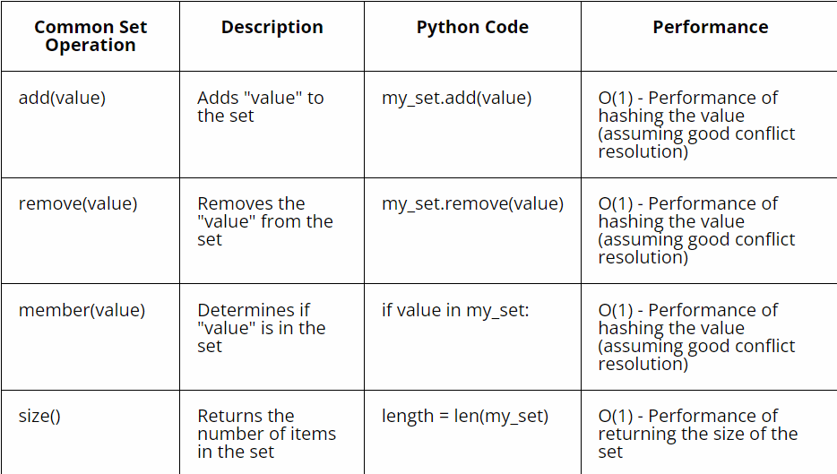

# SETS

### INTRODUCTION
Welcome to the course about Sets! Before we dive into coding examples, let's first explain when they are used in real-life situations.

Picture yourself overseeing enrollment records for a university. Here, each student may enroll in multiple courses. However, it's crucial to prevent duplicate entries of the same course for a single student.

For example:

- Student A is taking Computer Science, Math, and English.
- Student B is taking Math and History.
- Student C is taking Physics and Chemistry.

To handle this data, we'll use something called a Set. Sets are great because they make sure there are no duplicates. We'll make a set for each student's classes. That way, if a student tries to sign up for a class they're already in, it won't mess things up.

So, in our example using sets helps us keep our records clean and organized, which is really important in programming.


# Basic Concepts of Sets

I want to let you know that creating a set is very simple and useful to avoid redundancy. I dropped below the basic python code for using the set Data Structure and their performance in Big O. 



### OPERATIONS ON SETS


**Union** 

The union of two sets A and B contains all the elements that are in either set A or set B, or in both.

A Simplified explanation goes like this, A Union is like combining two groups together. If you have one group of friends who like apples and another group who like oranges, the union of those groups would include everyone who likes either apples or oranges, or both.

    Example:
    - Set H = {1, 2, 3}
    - Set I = {3, 4, 5}
    - Union of Set H and Set I = {1, 2, 3, 4, 5}

 **Intersection**

The intersection of two sets A and B consists of all the elements that are common to both sets.

A Simplified explanation, Intersection is like finding what two groups have in common. If one group likes cats and the other group likes dogs, the intersection would include only the people who like both cats and dogs.

    Example:
    - Set F = {1, 2, 3}
    - Set G = {2, 3, 4}
    - Intersection of Set F and Set G = {2, 3}

**Difference** 

The difference between two sets A and B (denoted by A - B) contains all the elements that are in set A but not in set B.

Simplified explanation: Difference is like taking away one group from another. If one group has all the students who play soccer and another group has all the students who play basketball, the difference would include only the students who play soccer but not basketball.

    Example:
    - Set J = {1, 2, 3, 4}
    - Set K = {3, 4, 5}
    - Difference of Set J and Set K = {1, 2}
**COMPLEMENT OF A SET**

The complement of a set A with respect to a universal set U contains all the elements in U that are not in A.

Simplified explanation: Complement is like finding what's missing from a group. If you have a group of all the fruits people like (like apples, bananas, and oranges), the complement would include all the fruits that nobody likes, but are still available (like grapes and watermelons).

#### Example:
Let's say we have a universal set U = {1, 2, 3, 4, 5} and a set A = {2, 4}. The complement of set A, denoted as A', would include all elements in U that are not in A.

So, 
- Set A = {2, 4}
- Universal set U = {1, 2, 3, 4, 5}

The complement of set A, A', would be:
A' = {1, 3, 5}

This means that A' contains all the elements from U that are not present in set A.

**Symmetric Difference Method:**

Returns the symmetric difference of two sets A and B, containing elements that are in either A or B, but not in both.

Example:

If set A = {1, 2, 3} and set B = {3, 4, 5}, the symmetric difference is {1, 2, 4, 5}.

**Subset Check Method**

Checks if all elements of one set are present in another set.

Example:

If set A = {1, 2} and set B = {1, 2, 3, 4}, then A is a subset of B.

**Proper Subset Check Method:**

Definition:
Checks if one set is a subset of another and also ensures they are not equal.

Example:

If set A = {1, 2} and set B = {1, 2, 3, 4}, then A is a proper subset of B.

## TYPES OF SETS 

A. **FINITE SETS:**

A finite set is like a box of toys. You can count exactly how many toys are in the box because there's a limited number of them. For example, if you have a set of your favorite books, like 'Harry Potter' and 'Percy Jackson', that would be a finite set because there's a specific number of books you like. So, when we talk about finite sets, we're talking about collections of things that you can count and list out.

B. **INFINITE SETS:**

Now, let's move on to infinite sets or in other words never ending sets. An example could be the set of all possible fractions between 0 and 1. There are infinitely many fractions between those two numbers. So, when we talk about infinite sets, we're talking about collections of things that never end. One example of this could be a libray database, there will always be new books each year. 

C. **EMPTY SET:**

Lastly, let's talk about the empty set, also known as the null set. Now, this one might seem a bit strange at first. Imagine you have a box, but it's completely empty. There's nothing inside it. That's what we mean by an empty set. It's a set that contains no elements. It's like having a list of your favorite colors, but you haven't decided on any yet. So, when we talk about the empty set, we're talking about a set with absolutely nothing in it."

**PROPERTIES OF SETS**

1. **Elements**: Sets consist of distinct elements, which are the individual items contained within the set. Another way to put it is Sets are collections of different things. For example, if you have a set of fruits, each fruit in the set (like apples, bananas, etc.) is called an element.

    Example:
    - Set A = {1, 2, 3, 4}
    - Set B = {apple, banana, orange}

2. **Uniqueness**: Each element in a set is unique. There are no duplicate elements within the same set. If you have a set of numbers, you only list each number once, even if you think of it multiple times.

    Example:
    - Set C = {1, 2, 3, 3, 4, 4, 4} (This set will be considered as {1, 2, 3, 4})

3. **Membership**: An element either belongs to a set or does not. This is known as the membership property of sets.  You're either in the club (set) or you're not.

    Example:
    - Is 2 a member of Set A? (Yes)
    - Is "grape" a member of Set B? (No)

4. **Cardinality**: The cardinality of a set refers to the number of elements it contains. For finite sets, this can be determined by counting the elements.

    Example:
    - Cardinality of Set A = 4
    - Cardinality of Set B = 3

5. **Subset**: A set A is considered a subset of another set B if every element of A is also an element of B. 

    Example:
    - Set D = {1, 2}
    - Set E = {1, 2, 3, 4}
    - Is Set D a subset of Set E? (Yes)

## APPLICATIONS OF SETS

 **EXAMPLES PROBLEMS** 

1. **Removing Duplicates from a List**:
   - Problem: Given a list of numbers, remove any duplicate numbers and return a list with only unique numbers.
   - Solution using sets:
     ```python
     numbers = [1, 2, 3, 4, 2, 3, 5, 6]
     unique_numbers = list(set(numbers))
     print(unique_numbers)  # Output: [1, 2, 3, 4, 5, 6]
     ```

2. **Checking Common Elements in Two Lists**:
   - Problem: Given two lists of numbers, find the common numbers between them.
   - Solution using sets:
     ```python
     list1 = [1, 2, 3, 4, 5]
     list2 = [4, 5, 6, 7, 8]
     common_numbers = set(list1) & set(list2)
     print(common_numbers)  # Output: {4, 5}
     ```

3. **Counting Unique Characters in a String**:
   - Problem: Given a string, count the number of unique characters it contains.
   - Solution using sets:
     ```python
     string = "hello world"
     unique_characters = set(string)
     count = len(unique_characters)
     print(count)  # Output: 8 (including the space)
     ```

These examples demonstrate how sets can be used to efficiently solve problems related to removing duplicates, finding common elements, and counting unique elements in data structures like lists and strings.

**CHALLENGE**
Here is a sample problem that will teach you how to use a circular. Go ahead and solve this problem.

([setsQuestion.py](setsQuestion.py))

After writing the the code above compare it to this code block here. This is a sample solution.

([setsAnswerKey.py](setsAnswerKey.py))