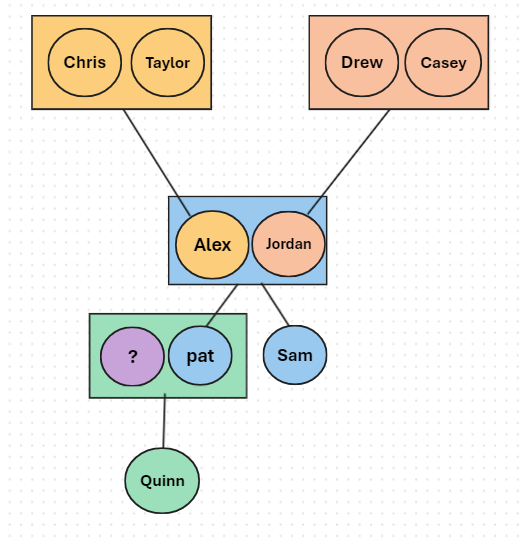
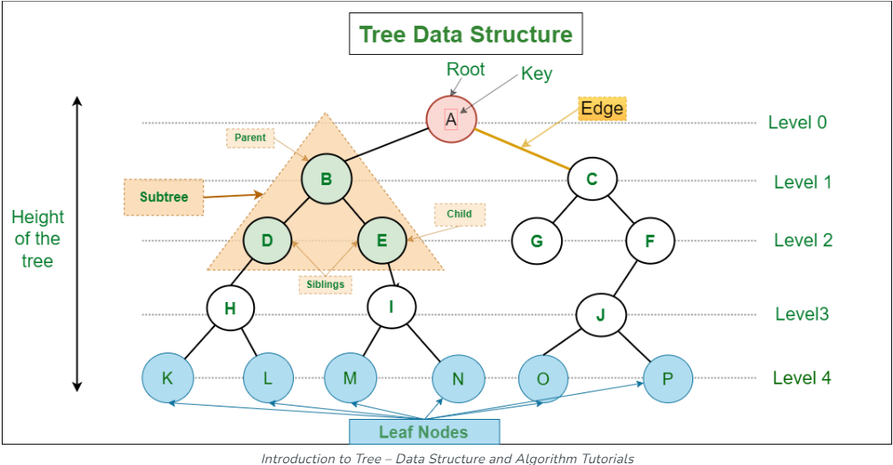
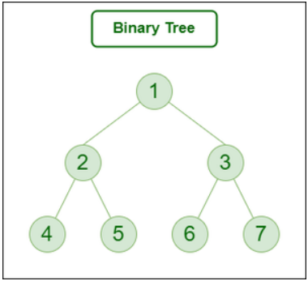
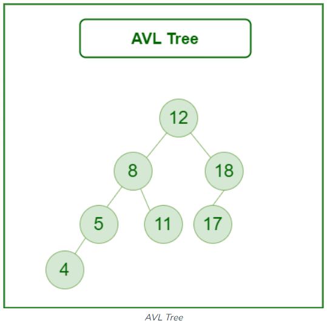
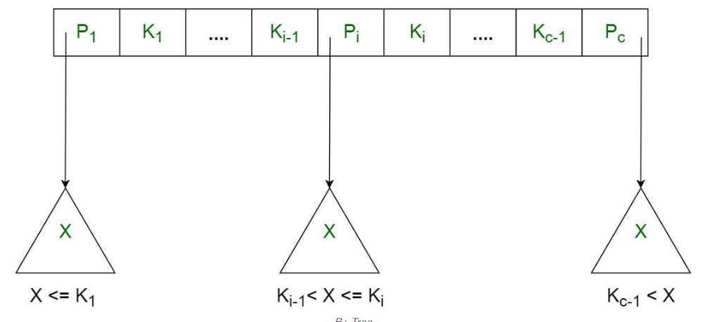

# TREES
## INTRODUCTION
**What is a tree data structure?**

A tree data structure is a way to store and organize information in a computer, making it easier to find and use. Imagine it like a real tree flipped upside down. At the top is the root, which is the starting point. From there, branches (called edges) extend to nodes, which are like the leaves and fruits of the tree. Each node can have its own smaller branches and nodes, creating a family-like hierarchy.

Think of it like creating a family tree. You and your partner are at one level, and your parents and your partner's parents are at the level above you because they are the roots of your family lines. If you have children, they would be below you, like branches extending downwards. This setup helps you see how everyone is related.

This tree structure helps organize data so that it's quick to search through and manage. The root is the main starting point, and everything else branches off from there. Each item or piece of information in the tree is a node, connected by lines (edges) that show how they're related, just like how family members are connected in a family tree. This makes it easier to see how pieces of data are related to each other and to find specific information when needed.


Let's create a simple example to illustrate how a tree data structure might look, using the concept of a family tree for clarity.

Imagine we're building a family tree for a person named Alex. Alex has married Jordan, and they have two children, Pat and Sam. Alex's parents are Chris and Taylor, while Jordan's parents are Casey and Drew. Pat has a child named Quinn.

Here's how we can represent this family tree as a tree data structure:



Chris and Taylor (Alex's parents) are at the top level, because they are the roots from Alex's side.
Casey and Drew (Jordan's parents) are also at the top level, representing the roots from Jordan's side.
Alex and Jordan are at the second level, connected to their respective parents.
Pat and Sam, the children of Alex and Jordan, are at the third level, directly under Alex and Jordan.
Quinn, the child of Pat, is at the fourth level, under Pat.
The relationships are as follows:

Chris and Taylor are connected to Alex.
Casey and Drew are connected to Jordan.
Alex and Jordan are connected to each other and to their children, Pat and Sam.
Pat is connected to Quinn.
This creates a hierarchy where you can trace the lineage and relationships from the roots down to the youngest generation. Each person in the tree is a "node," and the connections between them are the "edges." This structure makes it easy to navigate the family relationships, similar to how data can be organized and managed in a computer's tree data structure.

[Resource](https://www.geeksforgeeks.org/introduction-to-tree-data-structure-and-algorithm-tutorials/)

## BASIC CONCEPTS OF TREES

**TERMINOLOGY**

Understanding the terminology used in tree data structures is crucial for grasping how they function and are utilized in Programing. Here are some key terms:



**A. NODE**
: A node is the basic unit of a tree data structure. Think of it like a single data point or a container that holds values or information. In a family tree, a person would be represented as a node. The circle shapes above are nodes.

**B. ROOT**: 
The root is the top-most node in a tree, from which all other nodes branch out. It does not have a parent. In a family tree analogy, the oldest ancestors (from whom all other family members descend) could be considered the root. A is the root.

**C. PARENT**:
A parent is any node that has branches leading to other nodes. A node directly connected above another node is considered its parent. In our family tree, your parents would be considered parent nodes to you. All of the nodes besides the leaf nodes are parents. 

**D. CHILD**:
A child is a node that is directly connected to another node below it. A node can have zero, one, or multiple children. In a family tree, you would be considered a child node to your parents. All node besides the roots have a subclass of child because they all have a parent node beside the root.

**E. LEAF**:
A leaf is a node that does not have any children. It's like the end point of a branch. In a family tree, individuals who do not have any children are considered leaves.

**F. HEIGHT**:
The height of a tree is the length of the longest path from the root to a leaf. It measures how tall the tree is. In simpler terms, it's the number of edges in the longest downward path from the root to a farthest leaf.

**G. DEPTH**:
The depth of a node is the number of edges from the root to the node. It indicates the level at which the node sits in the tree. For example, in a family tree, the generation level (how far from the oldest ancestor) would represent the depth of a person-node in that tree.

**These terms form the foundation of understanding tree data structures, allowing for a clear communication of concepts and operations within them.**

## TYPES OF TREES 
Trees come in various types, each with its unique properties and applications. Understanding these types helps in choosing the right tree for a specific problem. Here's a brief overview of some common types of trees along with examples for better understanding:

### A. BINARY TREE
A binary tree is a tree data structure where each node has at most two children, referred to as the left child and the right child. It's a simple and foundational type of tree used in many applications.

A binary Search Tree is a node-based binary tree data structure that has the following properties:

The left subtree of a node contains only nodes with keys lesser than the node’s key.
The right subtree of a node contains only nodes with keys greater than the node’s key.
The left and right subtree each must also be a binary search tree.

**Since each node of this tree has only 2 children, it can be said that this tree is a Binary Tree**



**Example:**  
Consider a small family tree. At the top is a grandparent node, with two children nodes representing the parent generation (say, an aunt and a parent). The parent node also has two children (you and a sibling). Each person is a node, and each node has at most two children.

### B. BINARY SEARCH TREE (BST)
A binary search tree is a special kind of binary tree that is used for efficient searching and sorting. In a BST, the left child of a node contains a value less than its parent node, and the right child contains a value greater than its parent node. This property makes searching very efficient.

**Example:**  
### BST Node Structure
First, define the structure of a node in the BST.

```python
# Define a TreeNode class to represent each node in the tree
class TreeNode:
    def __init__(self, value):
        self.value = value  # The value or data held by the node
        self.left = None  # Pointer to the left child node
        self.right = None  # Pointer to the right child node

# Define a BinarySearchTree class to encapsulate BST operations
class BinarySearchTree:
    def __init__(self):
        self.root = None  # Initialize the root of the tree to None

    # Method to insert a new value into the tree
    def insert(self, value):
        if self.root is None:
            self.root = TreeNode(value)  # If tree is empty, set new node as root
        else:
            self._insert_recursive(self.root, value)  # Otherwise, proceed with recursive insertion

    # Helper method to recursively insert a new value in the correct location
    def _insert_recursive(self, current_node, value):
        if value < current_node.value:
            # If value is less than current node, go left
            if current_node.left is None:
                # If left child doesn't exist, insert here
                current_node.left = TreeNode(value)
            else:
                # Otherwise, recurse into the left subtree
                self._insert_recursive(current_node.left, value)
        elif value > current_node.value:
            # If value is greater than current node, go right
            if current_node.right is None:
                # If right child doesn't exist, insert here
                current_node.right = TreeNode(value)
            else:
                # Otherwise, recurse into the right subtree
                self._insert_recursive(current_node.right, value)
        else:
            # Value already exists in the tree
            print("Value already in tree!")

    # Method to search for a value in the tree
    def search(self, value):
        return self._search_recursive(self.root, value)  # Start the search from the root

    # Helper method to recursively search for a value
    def _search_recursive(self, current_node, value):
        if current_node is None:
            # Base case: reached end of path without finding value
            return False
        elif value == current_node.value:
            # Value is found
            return True
        elif value < current_node.value:
            # If value is less, search in the left subtree
            return self._search_recursive(current_node.left, value)
        else:
            # If value is more, search in the right subtree
            return self._search_recursive(current_node.right, value)

# Example usage
bst = BinarySearchTree()  # Create a BinarySearchTree instance
# Insert values into the BST
bst.insert(5)
bst.insert(3)
bst.insert(7)
bst.insert(2)
bst.insert(4)

# Search for values in the BST and print the results
print(bst.search(4))  # Output: True, indicating that 4 was found in the BST
print(bst.search(6))  # Output: False, indicating that 6 was not found in the BST

```

### C. BALANCED TREE / AVL Tree
A balanced tree is designed to keep the tree's height as low as possible while adding or removing nodes to maintain quick search times. This type of tree adjusts itself (rebalances) to ensure that no leaf is much farther away from the root than any other leaf.



**AVL tree is a self-balancing Binary Search Tree (BST) where the difference between heights of left and right subtrees for any node cannot be more than one.**

**Example:**  
Think of it like organizing a competition where teams are in a tournament bracket. To ensure no team has a significantly longer path to the final, the organizer balances the bracket so that all teams have an equal chance and the tournament progresses evenly.

### D. B-TREE
A B-tree is a self-balancing tree data structure that maintains sorted data in a way that allows for searches, sequential access, insertions, and deletions in logarithmic time. It's commonly used in databases and filesystems.



**Example:**  
Imagine a filing system used by a large corporation for storing employee records in several cabinets. Each cabinet (node) can hold multiple files (children), and the cabinets are organized in a way that makes it easy to add new employee records, find a specific file quickly, or remove old records efficiently, even as the total number of files grows very large.

There are main different tree structure out there, if your interested in looking at different types of trees click here: 
 [Source](https://www.geeksforgeeks.org/types-of-trees-in-data-structures/)
## TREE TRAVERSAL

Tree traversal is the process of visiting all the nodes in a tree and can be performed in various ways. Each method of traversal visits the nodes in a different order, which can be useful for different applications. Here are three common methods of tree traversal:

#### A. INORDER TRAVERSAL
In an inorder traversal, the nodes are visited in a left-root-right sequence. If performed on a binary search tree (BST), this traversal visits the nodes in ascending order. The process is as follows: traverse the left subtree, visit the root node, and finally, traverse the right subtree.

#### B. PREORDER TRAVERSAL
In a preorder traversal, the nodes are visited in a root-left-right sequence. This method is used when you need to explore roots before inspecting leaves. The process involves visiting the root node first, then traversing the left subtree, and finally, the right subtree.

#### C. POSTORDER TRAVERSAL
Postorder traversal visits the nodes in a left-right-root sequence. This method is useful for deleting or freeing nodes and space of the tree in a safe manner, as it visits the root node last. The process involves traversing the left subtree, then the right subtree, and finally, visiting the root node.

### Application of Tree Traversals

The different tree traversal methods have various applications:

**Inorder Traversal Applications:**
- **Binary Search Trees (BSTs):** By traversing a BST in-order, you can extract sorted data from the tree, which is useful for sorting and retrieving data in an ordered manner.
- **Expression Trees:** Inorder traversal can be used to generate infix expressions from expression trees.

**Preorder Traversal Applications:**
- **Tree Copy:** Preorder traversal is ideal for cloning or copying a tree, as it creates a copy of the node before visiting its children.
- **Expression Trees:** Used to generate prefix expressions from expression trees.
- **Filesystem Hierarchy:** Preorder traversal can model operations that need to visit parent directories before their children, such as displaying or backing up a directory structure.

**Postorder Traversal Applications:**
- **Tree Deletion:** Since postorder traversal visits children before the nodes themselves, it's suited for safely deleting or freeing up space from a tree.
- **Expression Trees:** Used to generate postfix expressions from expression trees.
- **Dependency Trees:** In systems where tasks have dependencies, postorder traversal can ensure tasks are completed in the correct order, with dependent tasks being done first.

Each traversal method offers a unique way to navigate and utilize the structure of trees, making tree traversal a fundamental concept in algorithms and data structures.

### EXAMPLES PROBLEMS
1. Inorder Traversal Example: Sort a Binary Search Tree (BST)
This example uses inorder traversal to extract elements from a BST in sorted order.

```python
Copy code
class TreeNode:
    def __init__(self, value):
        self.value = value
        self.left = None
        self.right = None

def inorder_traversal(root, result=None):
    if result is None:
        result = []
    if root:
        inorder_traversal(root.left, result)
        result.append(root.value)
        inorder_traversal(root.right, result)
    return result

# Example usage:
root = TreeNode(5)
root.left = TreeNode(3)
root.left.left = TreeNode(2)
root.left.right = TreeNode(4)
root.right = TreeNode(7)
root.right.left = TreeNode(6)
root.right.right = TreeNode(8)

sorted_values = inorder_traversal(root)
print("Sorted Values:", sorted_values)
```

2. Preorder Traversal Example: Serialize a Tree
This example demonstrates how to use preorder traversal to serialize a tree into a string which can later be deserialized back into the tree.

```python
Copy code
class TreeNode:
    def __init__(self, value):
        self.value = value
        self.left = None
        self.right = None

def serialize(root, result=None):
    if result is None:
        result = []
    if root:
        result.append(str(root.value))
        serialize(root.left, result)
        serialize(root.right, result)
    else:
        result.append('#')  # A marker for None node
    return ' '.join(result)

# Example usage:
root = TreeNode(1)
root.left = TreeNode(2)
root.right = TreeNode(3)
root.right.left = TreeNode(4)
root.right.right = TreeNode(5)

serialized_tree = serialize(root)
print("Serialized Tree:", serialized_tree)
```
3. Postorder Traversal Example: Calculate the Total Sum of All Nodes
This example uses postorder traversal to calculate the sum of all nodes in a binary tree.

```python
Copy code
class TreeNode:
    def __init__(self, value):
        self.value = value
        self.left = None
        self.right = None

def postorder_sum(root):
    if root is None:
        return 0
    left_sum = postorder_sum(root.left)
    right_sum = postorder_sum(root.right)
    return root.value + left_sum + right_sum

# Example usage:
root = TreeNode(10)
root.left = TreeNode(5)
root.right = TreeNode(15)
root.left.left = TreeNode(3)
root.left.right = TreeNode(7)
root.right.right = TreeNode(18)

total_sum = postorder_sum(root)
print("Total Sum:", total_sum)
```

**CHALLENGE**

Challenge Problem: Evaluate an Arithmetic Expression Tree
Background:
An arithmetic expression tree is a binary tree where each node represents an operator (+, -, *, /) or an operand (an integer value). For example, the expression 3 + ((5 * 2) - (4/2)) can be represented as an expression tree:

        +
       / \
      3   -
         / \
        *   /
       / \ / \
      5  2 4  2
Objective:
Write a Python function that evaluates an arithmetic expression tree using postorder traversal. Your function should return the result of the arithmetic expression.

Requirements:

Your solution must use postorder traversal to evaluate the expression tree.
The tree nodes can be either operators (+, -, *, /) as strings or operands (integer values).
You may assume the tree is a valid non-empty arithmetic expression.
Division is integer division.
Example Tree Node Class:

```python
class TreeNode:
    def __init__(self, value):
        self.value = value
        self.left = None
        self.right = None
```
Example Input:

For the expression 3 + ((5*2) - (4/2)), the tree is represented as shown above.

Example Function Call:

```python
result = evaluate_expression_tree(root)
print(result)  # Output should be 11
```
Hints:

Start by implementing the postorder traversal to visit each node in the correct order.
Consider how you will handle nodes that represent operators versus those that represent operands.
Think about how the recursive nature of postorder traversal can help you evaluate the expression as you traverse the tree.
This challenge requires students to apply their understanding of postorder traversal to solve a practical problem, reinforcing their grasp of both tree traversal and expression evaluation concepts.

[Python File](arithmetic_expression_tree_challenge.py)

After completing the exercise go ahead and check the solution.

[solution file](arithmetic_expression_tree_solution.py)